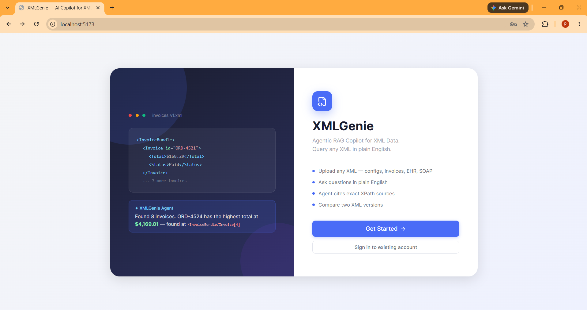
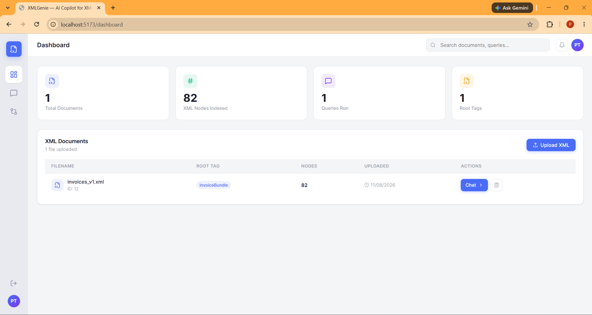
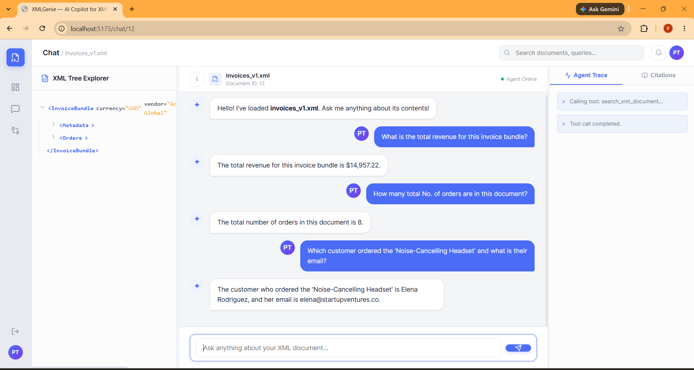
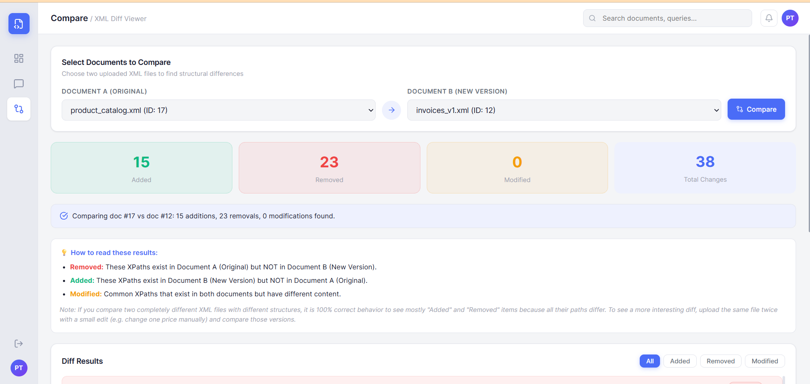
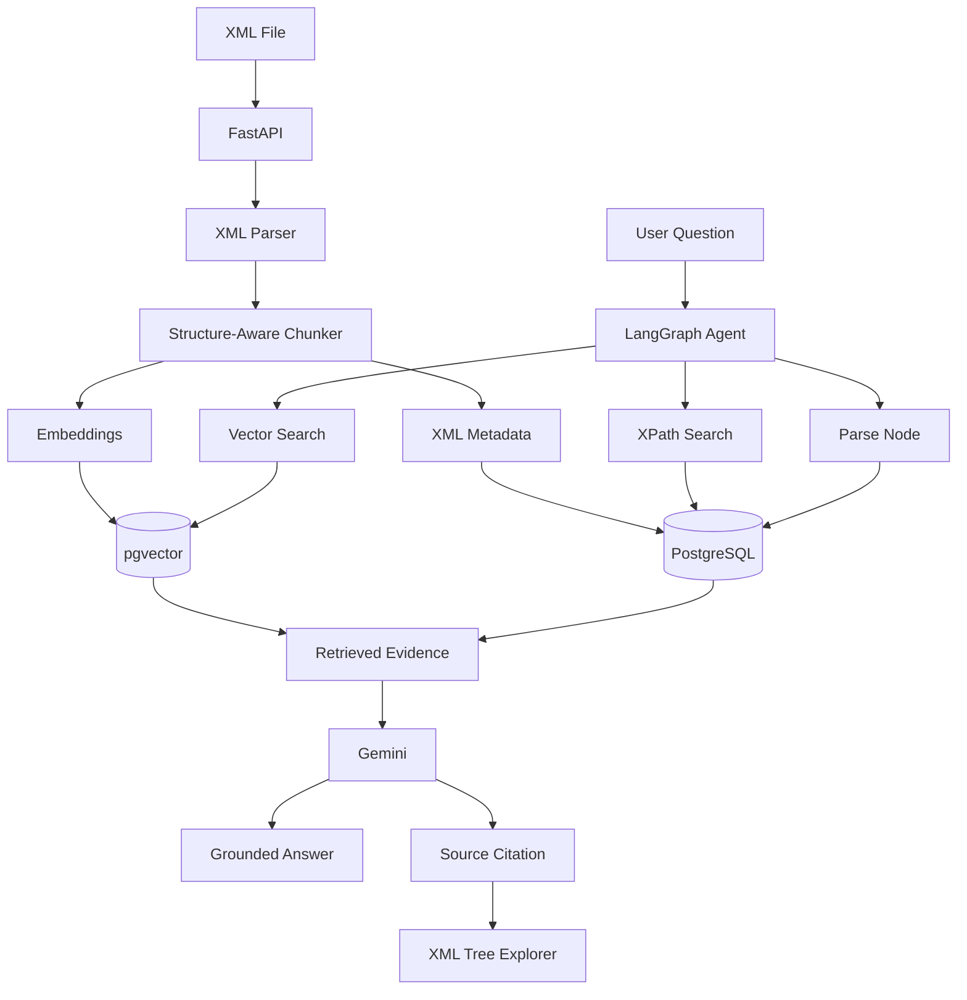

# 🧞 XMLGenie — AI Copilot for XML Data

### Ask questions about XML files in plain English and see exactly where the answer came from.

XMLGenie is a full-stack AI application I built to make large and complicated XML files easier to work with.

You can upload an XML file, ask questions about it in natural language, explore its structure, and get answers with references to the original XML nodes. It also includes an XML comparison tool for finding changes between two files.

The main idea is simple:

> **Instead of manually searching through XML or writing XPath queries, just ask the question.**

---

## 🚀 Demo

Here are a few screens from the application.

### Landing Page



### Dashboard



### Chat + XML Explorer + Agent Trace



### XML Diff Viewer



---

## 🤔 Why I Built This

XML is still used in a lot of real systems — invoices, product catalogs, configurations, API responses, enterprise applications, and logs.

The problem is that XML can become difficult to work with once it gets deeply nested.

If someone wants to find something like:

> "Which customer ordered the Noise-Cancelling Headset?"

they might have to search through the XML manually or ask a developer to write an XPath query.

I wanted to build a system where the user can simply **upload the XML and ask the question directly**.

---

# ✨ What Can XMLGenie Do?

* 📄 **Upload XML files** and automatically index their contents
* 💬 **Ask questions in plain English**
* 🤖 Use an **AI agent** to decide how the question should be answered
* 🔎 Search XML using both **semantic search and XPath**
* 🌳 Explore the original XML using an interactive **XML Tree Explorer**
* 🔗 See the **exact XML node / XPath** used to support an answer
* ⚡ See the agent's tool activity through a **live trace**
* 🔄 Compare two XML files and see **added, removed, and modified nodes**
* 🧪 Evaluate retrieval and answer quality using a small evaluation dataset

---

# 🧠 How It Works

The basic flow looks like this:

```text
Upload XML
    ↓
Parse the XML
    ↓
Split it into structure-aware chunks
    ↓
Create embeddings + store XML metadata
    ↓
User asks a question
    ↓
LangGraph Agent decides what to do
    ↓
┌───────────────────────┐
│ Vector Search         │
│ XPath Search          │
│ Source Node Retrieval │
└───────────────────────┘
    ↓
Relevant XML evidence
    ↓
LLM generates the answer
    ↓
Answer + XML source citation
```

The important part here is that I didn't want the LLM to simply "read the XML and answer."

The agent first retrieves relevant information from the actual document and then uses that information to generate the response.

---

# 🔎 Why Use Both Vector Search and XPath?

This was one of the main design decisions in the project.

XML has two different kinds of information.

### Semantic questions

For example:

> "Which shipments were delayed because of weather?"

This is a good use case for **semantic/vector search** because the user may not use the exact words that appear in the XML.

### Exact questions

For example:

> "Find order ORD-4521."

This is better handled using **XPath or attribute-based lookup**.

So XMLGenie uses both:

```text
                 User Question
                      │
             ┌────────┴────────┐
             ↓                 ↓
       Vector Search       XPath Search
        "What is..."       "Find ORD-4521"
             │                 │
             └────────┬────────┘
                      ↓
                XML Evidence
                      ↓
                  AI Agent
                      ↓
                 Final Answer
```

This gives the application the flexibility of semantic search without ignoring the structure that makes XML useful in the first place.

---

# 🌳 Structure-Aware XML Chunking

A normal RAG pipeline often splits documents into fixed-size text chunks.

That isn't ideal for XML.

Consider:

```xml
<Order id="ORD-4521">
    <Customer>ABC Corp</Customer>

    <Shipping>
        <PromisedDate>2026-03-10</PromisedDate>
        <ActualDate>2026-03-14</ActualDate>
        <Carrier>XYZ Logistics</Carrier>
    </Shipping>
</Order>
```

If this was split purely by character count, information belonging to the same order could end up in different chunks.

Instead, XMLGenie works with the **XML structure itself**.

The chunks retain information such as:

* Document ID
* XML path
* Node information
* Attributes
* Parent context
* Node content

This makes the retrieved information more useful when answering questions about nested XML data.

---

# 🔗 Answers With Source References

One thing I wanted to avoid was an answer that simply says:

> "The total revenue is $14,957.22."

but gives the user no way to verify it.

XMLGenie keeps track of where retrieved information came from.

The idea is:

```text
AI Answer
    ↓
Citation
    ↓
XPath
    ↓
Original XML Node
```

So the user can move from the answer back to the relevant part of the XML.

This is especially useful when the XML contains business or financial information where users need to verify the result.

---

# 🤖 Agentic RAG

The question isn't always as simple as:

```text
Question → Search → Answer
```

Some questions require multiple retrieval steps.

For example:

> "Which orders were shipped late and what caused the delays?"

The system may need to:

```text
1. Find the orders
       ↓
2. Check promised dates
       ↓
3. Check actual shipping dates
       ↓
4. Identify late orders
       ↓
5. Find their shipping notes
       ↓
6. Generate the final answer
```

That's where the **LangGraph agent** comes in.

The agent has access to several tools and can decide which one it needs based on the question.

---

# 🧰 Agent Tools

| Tool            | What it does                                        |
| --------------- | --------------------------------------------------- |
| `vector_search` | Finds semantically relevant XML content             |
| `run_xpath`     | Performs exact XPath / attribute lookups            |
| `parse_node`    | Gets the original XML node                          |
| `diff_files`    | Compares two XML documents                          |
| `summarize`     | Creates a concise answer from retrieved information |

This also makes the system easier to extend because new XML operations can be added as separate tools instead of putting everything into one large prompt.

---

# ⚡ Live Agent Trace

The application also shows what the agent is doing while it works.

For example:

```text
Calling tool: search_xml_document
        ↓
Tool call completed
        ↓
Retrieving relevant XML nodes
        ↓
Generating answer
        ↓
Answer ready
```

These events are streamed to the frontend using **WebSockets**.

I added this mainly because agent-based applications can otherwise feel like a black box. Seeing the tool activity makes it easier to understand what happened and also helps during development and debugging.

---

# 🔄 XML Diff Viewer

XMLGenie isn't limited to asking questions.

It also includes a separate comparison page where two XML files can be uploaded and compared.

The comparison identifies:

```text
Added
Removed
Modified
```

For example:

```text
Document A
    │
    │
    ▼
 Diff Engine
    │
    ├── 15 Added
    ├── 23 Removed
    └── 4 Modified
    │
    ▼
Document B
```

This can be useful when comparing different versions of:

* Configuration files
* Product catalogs
* Invoices
* API responses
* Enterprise XML documents

---

# 🏗️ Architecture



---

# 🛠️ Tech Stack

| Area             | Technologies                          |
| ---------------- | ------------------------------------- |
| Frontend         | React, TypeScript, Vite               |
| Styling          | TailwindCSS                           |
| State Management | Zustand                               |
| Data Fetching    | React Query                           |
| Backend          | Python, FastAPI                       |
| Realtime         | WebSockets                            |
| Database         | PostgreSQL                            |
| Vector Search    | pgvector                              |
| ORM              | SQLAlchemy                            |
| Migrations       | Alembic                               |
| XML Processing   | lxml, xmltodict                       |
| Agent            | LangGraph, LangChain                  |
| LLM              | Google Gemini API                     |
| Authentication   | JWT, bcrypt                           |
| Background Jobs  | Celery, Redis                         |
| Testing          | pytest, Vitest, React Testing Library |
| Deployment       | Docker, Render, Vercel                |

---

# 📁 Project Structure

```text
XMLGenie/
│
├── backend/
│   ├── app/
│   │   ├── api/
│   │   │   ├── auth/
│   │   │   ├── upload/
│   │   │   ├── documents/
│   │   │   ├── chat/
│   │   │   └── diff/
│   │   │
│   │   ├── models/
│   │   ├── services/
│   │   │   ├── xml_parser.py
│   │   │   ├── chunker.py
│   │   │   ├── retriever.py
│   │   │   ├── differ.py
│   │   │   └── agent/
│   │   │
│   │   └── main.py
│   │
│   └── eval/
│       └── run_eval.py
│
├── frontend/
│   └── src/
│       ├── pages/
│       ├── components/
│       ├── services/
│       └── store/
│
├── sample_data/
│   └── XML files used for testing/demo
│
├── docs/
│   └── screenshots/
│
├── docker-compose.yml
├── LICENSE
└── README.md
```

---

# 🚀 Getting Started

## Prerequisites

You'll need:

* Python 3.11+
* Node.js 18+
* Docker
* Docker Compose
* Gemini API key

---

## 1. Clone the repository

```bash
git clone https://github.com/Prithvirajpvgcoet/XMLGenie.git
cd XMLGenie
```

---

## 2. Start PostgreSQL, pgvector and Redis

```bash
docker-compose up -d
```

---

## 3. Start the backend

```bash
cd backend

python -m venv venv
```

### Windows

```bash
venv\Scripts\activate
```

### macOS / Linux

```bash
source venv/bin/activate
```

Install dependencies:

```bash
pip install -r requirements.txt
```

Create your environment file:

```bash
cp .env.example .env
```

Run migrations:

```bash
alembic upgrade head
```

Start FastAPI:

```bash
uvicorn app.main:app --reload
```

The backend will be available at:

```text
http://localhost:8000
```

Swagger documentation:

```text
http://localhost:8000/docs
```

---

## 4. Start the frontend

Open another terminal:

```bash
cd frontend
npm install
```

Create the environment file:

```bash
cp .env.example .env
```

Set the backend URL:

```env
VITE_API_BASE_URL=http://localhost:8000
```

Start the frontend:

```bash
npm run dev
```

Open:

```text
http://localhost:5173
```

Upload one of the XML files from `sample_data/` and start asking questions.

---

# 🔐 Environment Variables

### Backend — `backend/.env`

```env
DATABASE_URL=your_postgresql_connection_string
REDIS_URL=your_redis_connection_string
SECRET_KEY=your_jwt_secret
LLM_API_KEY=your_llm_api_key
LLM_PROVIDER=gemini
```

### Frontend — `frontend/.env`

```env
VITE_API_BASE_URL=http://localhost:8000
```

**Don't commit `.env` files or API keys to GitHub.**

---

# 💬 Example Questions

Once an XML file is uploaded, you can ask things like:

```text
What is the total revenue for this invoice bundle?
```

```text
How many orders are in this document?
```

```text
Which customer ordered the Noise-Cancelling Headset?
```

```text
What is that customer's email?
```

```text
Which orders were shipped late?
```

```text
What caused the shipping delays?
```

```text
Find order ORD-4521.
```

The answer can then be traced back to the relevant XML node.

---

# 🔌 API

The backend exposes a small REST + WebSocket API.

| Method | Endpoint                   | Purpose                   |
| ------ | -------------------------- | ------------------------- |
| `POST` | `/api/auth/signup`         | Create an account         |
| `POST` | `/api/auth/login`          | Login and receive JWT     |
| `POST` | `/api/upload`              | Upload and process XML    |
| `GET`  | `/api/documents`           | List uploaded XML files   |
| `GET`  | `/api/documents/{id}/tree` | Get the XML tree          |
| `POST` | `/api/retrieve`            | Inspect retrieval results |
| `POST` | `/api/chat`                | Ask the AI agent          |
| `WS`   | `/ws/chat`                 | Stream agent events       |
| `POST` | `/api/diff`                | Compare two XML files     |

Interactive API documentation is available at:

```text
http://localhost:8000/docs
```

---

# 🧪 Evaluation

I also included a small evaluation setup for testing the RAG pipeline.

The dataset contains questions where the expected answer and XML source are already known.

Run:

```bash
python backend/eval/run_eval.py
```

The evaluation can be used to check:

* Answer correctness
* Retrieval quality
* Citation accuracy
* Groundedness

The idea is to have something more objective than simply checking whether the chatbot "looks right."

---

# 🗺️ What's Next?

There are a few things I'd like to add as the project grows:

* [ ] XSD-based XML validation
* [ ] Validation warnings in the UI
* [ ] Multi-file querying
* [ ] Better retrieval evaluation
* [ ] Export chats and diffs as PDF
* [ ] Support for more LLM providers
* [ ] Local LLM support using Ollama
* [ ] Better XML schema understanding

---

# 🤝 Contributing

If you'd like to experiment with the project:

```text
1. Fork the repository
2. Create a new branch
3. Make your changes
4. Add tests where needed
5. Open a pull request
```

For larger changes, feel free to open an issue first.

---

# 📄 License

This project is licensed under the **MIT License**.

See [`LICENSE`](LICENSE) for more information.

---

# 👨‍💻 About Me

**Prithviraj Thorat**

AI & Data Science | GenAI | Agentic RAG | Full-Stack AI

* GitHub: [Prithvirajpvgcoet](https://github.com/Prithvirajpvgcoet)
* LinkedIn: [Prithviraj Thorat](https://www.linkedin.com/in/prithviraj-thorat-3b002a289/)
* Email: [prithvirajthorat0770@gmail.com](mailto:prithvirajthorat0770@gmail.com)

---

<div align="center">

### 🧞 XMLGenie

**Ask your XML. Find the answer. See where it came from.**

⭐ If you find the project useful, consider giving it a star.

</div>
